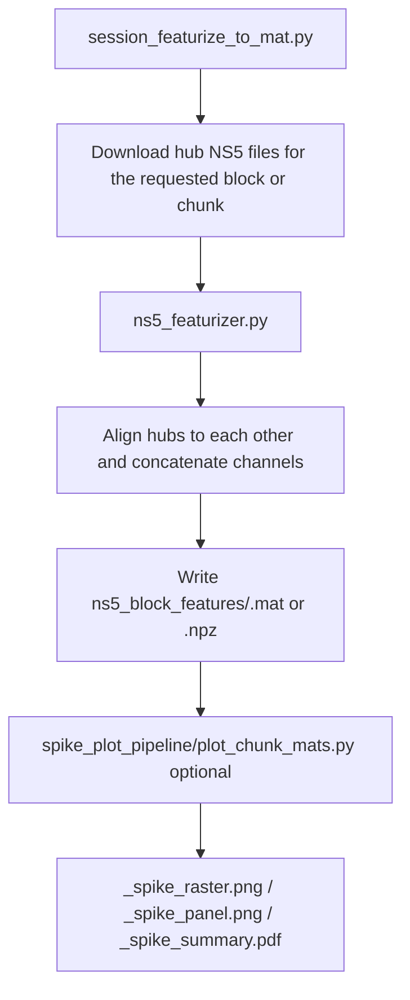
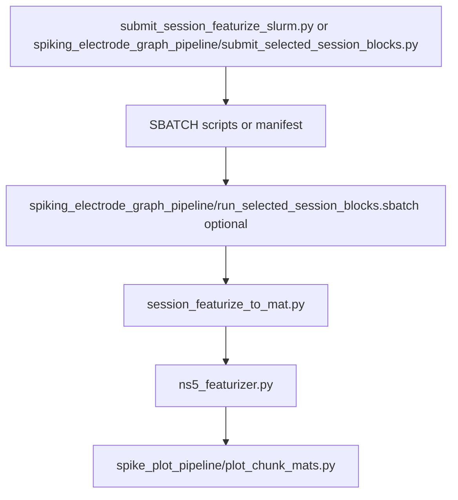

# ns5_featurizer_chunks

This directory contains the newer standalone NS5 pipeline.

The main entry point is `session_featurize_to_mat.py`. It does not attach anything back into RedisMat. Its job is:

1. download the NS5 files for a block
2. featurize them directly
3. align multiple hubs to each other
4. write a standalone block feature file
5. optionally generate diagnostic plots

If you want one self-contained `.mat` per block with NS5-derived features in native NS5 binning, this is the pipeline to use.

## What Changed Relative To The Older Pipeline

The older pipeline in `../ns5_featurizer/` still aligns features to RedisMat and writes `redisMats_with_ns5_features`.

This directory does not do that anymore.

The current chunk pipeline:

- does not download or read RedisMat files
- does not align to RedisMat timestamps
- does not write RedisMat-attached outputs
- writes standalone feature files under `ns5_block_features`
- supports full-block or partial-chunk featurization
- has a built-in plotting step via `spike_plot_pipeline/plot_chunk_mats.py`

## Workflow Folders

Downstream plotting code now lives in two dedicated subfolders:

- `spike_plot_pipeline/`
  - files that turn standalone `.mat` or `.npz` outputs into `*_spike_raster.png`, `*_spike_panel.png`, and `*_spike_summary.pdf`
- `spiking_electrode_graph_pipeline/`
  - files that turn standalone block feature `.mat` files into the per-array spiking-electrode summary graph

## Main Pieces

### `ns5_featurizer.py`

This is the low-level numerical feature extractor.

It can load an entire NS5 file or only a requested time span, which is what enables chunked processing.

The feature pipeline is:

1. Load voltage traces from `.ns5`.
2. Optionally decimate immediately with `--initial-decimate-to-hz` to reduce cost on long files.
3. Convert the raw values using `--voltage-scale`.
4. Build spike-domain features:
   - decimate 30 kHz spike data to 15 kHz
   - bandpass filter at 250 to 4900 Hz
   - optionally apply LRR
   - compute spike-band power per bin
   - compute threshold crossing counts per bin for one or more thresholds
5. Build LFP-domain features:
   - downsample to the target LFP sample rate
   - blank/interpolate large spike transients
   - optionally apply CAR
   - compute LMP
   - compute Hilbert-envelope features for delta, theta, beta, and gamma bands

The output is a set of binned arrays that all share the same time-bin grid.

### `session_featurize_to_mat.py`

This is the session/block orchestrator for the standalone pipeline.

Its current behavior is:

1. Find all blocks or a requested subset of blocks for a session.
2. Download the matching hub NS5 files.
3. Optionally download an `NSP*.ns5` file for audio.
4. For each hub:
   - load the full block or requested chunk
   - compute features
   - unscramble channels into electrode order when needed
5. Align the hubs to each other using cross-correlation on aggregate spike-band activity.
6. Concatenate all hub channels into one block-level output.
7. Save the result as `ns5_block_features/<block>.mat`.

Important point: the alignment here is hub-to-hub alignment within NS5 space, not alignment to RedisMat.

### `spike_plot_pipeline/plot_chunk_mats.py`

This script makes the main diagnostic figures from a block feature file.

It loads a standalone output `.mat` or `.npz`, chooses one `tx_from_ns5_*` matrix, and writes:

- `<block>_spike_raster.png`
- `<block>_spike_panel.png`
- `<block>_spike_summary.pdf`

This is the easiest way to visually sanity-check a processed block.

### `spiking_electrode_graph_pipeline/submit_selected_session_blocks.py`

This is a small study launcher.

It:

1. chooses a user-selected number of consecutive sessions starting from a requested session
2. picks one representative block per session
3. writes a manifest
4. optionally submits an SLURM array with one task per selected session

The selection rule is:

- choose the shortest block longer than `--min-duration-s`
- if none are that long, choose the longest available block

### `spiking_electrode_graph_pipeline/run_selected_session_blocks.sbatch`

This is the array-task runner used by the previous script.

Each SLURM task:

1. runs `session_featurize_to_mat.py` on the chosen block
2. runs `spike_plot_pipeline/plot_chunk_mats.py` on the resulting output file

## Execution Flow

### Main standalone block pipeline



### Batch entry points



## Inputs

The pipeline expects:

- a subject such as `t12`
- a session such as `t12.2025.11.04`
- GCS access via `gsutil`
- hub NS5 files, usually `Hub1*.ns5` and `Hub2*.ns5`
- optionally an `NSP*.ns5` file for audio-envelope extraction

Important command-line controls:

- `--blocks`: process all blocks or only a comma-separated subset
- `--bin-ms`: output time-bin width
- `--tx-thresh`: threshold crossing levels
- `--apply-lrr`: apply linear regression referencing on the spike path
- `--apply-car`: apply common average reference on the LFP path
- `--chunk-start-s`: start offset for chunked runs
- `--chunk-duration-s`: duration for chunked runs
- `--initial-decimate-to-hz`: early decimation for long recordings
- `--no-audio`: disable audio-envelope extraction

Deprecated options that should not be used here:

- `--align-by-timestamp`
- `--timestamp-field`
- `--redis-prefix`

Those belong to the RedisMat-attached pipeline, not this one.

## Outputs

The main output directory is:

- `<root-derived>/<session>/ns5_block_features/`

For each processed block, the pipeline writes:

- `<block>.mat`
- or `<block>.npz` if `.mat` writing fails

If `spike_plot_pipeline/plot_chunk_mats.py` is run, it also writes plot files next to the `.mat`.

## Fields In The Standalone Block Output

The key numerical fields are:

- `spike_band_power_from_ns5`
  - Shape: `[time_bins, channels]`
  - Meaning: binned spike-band power for all concatenated hub channels

- `tx_from_ns5_35`, `tx_from_ns5_45`, `tx_from_ns5_55`, `tx_from_ns5_65`
  - Shape: `[time_bins, channels]`
  - Meaning: threshold crossing counts per bin at the requested thresholds

- `lfpFeatures`
  - Structure containing:
    - `lmp`
    - `delta`
    - `theta`
    - `beta`
    - `gamma`

The most important metadata fields are:

- `session_name`
- `block_number`
- `ns5_source_hubs`
- `ns5_source_paths`
- `ns5_xcorr_reference_hub`
- `ns5_hub_alignment_lag_bins`
- `ns5_hub_alignment_start_bins`
- `ns5_total_channels`
- `ns5_total_bins`
- `ns5_featurizer_bin_ms`
- `ns5_chunk_start_s`
- `ns5_chunk_duration_s`
- `ns5_chunk_mode`
- `ns5_initial_decimate_to_hz` when used

Optional audio-related fields:

- `audio_envelope_from_ns5`
- `audio_ns5_path`
- `audio_envelope_detrend`
- `audio_ns5_timestamp`

## What The Output Arrays Mean

### Threshold crossing matrices

The `tx_from_ns5_*` arrays are the main event-count features.

Interpretation:

- rows = time bins
- columns = channels
- each value = number of threshold crossings detected in that bin for that channel

These are not spike-sorted units. They are threshold-crossing summaries of bandpassed voltage.

### Spike-band power

`spike_band_power_from_ns5` is a continuous-valued energy measure of the spike band. It is often useful for alignment because it is less sparse than threshold crossings.

### LFP features

`lfpFeatures` holds slower, continuous-valued features:

- `lmp`: low-pass local motor potential
- `delta`, `theta`, `beta`, `gamma`: band-envelope amplitudes

These are useful when you care about slower dynamics, oscillations, or analog state rather than discrete crossing counts.

### Chunk metadata

The chunk-related fields tell you whether the output came from:

- a full block: `ns5_chunk_mode = full_block`
- or a partial chunk: `ns5_chunk_mode = partial_chunk_native_timebase`

That matters when comparing output lengths across blocks. A chunk output is only a selected time window, not the whole recording.

## Graph Outputs And What They Represent

`spike_plot_pipeline/plot_chunk_mats.py` generates three diagnostics from a chosen threshold-crossing matrix, defaulting to `tx_from_ns5_45` unless another key is requested.

### `*_spike_raster.png`

This is a raster-style scatter plot.

What is shown:

- x-axis = time bin
- y-axis = channel
- one dot = that channel had `tx > 0` in that bin

What it represents:

- temporal sparsity of threshold crossings
- bursts across many channels
- long silent stretches
- channels that are consistently active or inactive

What it does not represent:

- sorted neurons
- exact spike timing at sub-bin resolution
- spike count magnitude beyond zero/nonzero

It is best interpreted as a quick occupancy plot of nonzero threshold-crossing bins.

### `*_spike_panel.png`

This is a heatmap of the same threshold-crossing matrix.

What is shown:

- x-axis = time bin
- y-axis = channel
- color = threshold crossing count in each bin

How to read it:

- brighter bands mean more crossings
- dark rows can indicate quiet or dead channels
- vertical stripes can indicate global artifacts or synchronized activity
- broad blocks of structure can reveal task epochs or sustained neural state changes

The plot currently clips the color scale to `(0, 2)` to suppress rare large-count bins and make low-count structure easier to see.

That means:

- `0` is truly no activity
- `1` and `2` are visually distinguishable
- anything above `2` is saturated to the top color

So this figure is for structure and pattern inspection, not precise quantitative reading of large counts.

### `*_spike_summary.pdf`

This PDF simply stacks the raster plot and the heatmap into one report page.

It is useful for:

- sharing one block summary
- comparing sessions quickly
- archiving diagnostics from batch runs

## Terminal Examples

### Full pipeline example

This command featurizes one full session using all discovered blocks:

```bash
python3 /oak/stanford/groups/henderj/mahanawaz/era3_bci_paper/other/session_featurize_to_mat.py \
  --subject t12 \
  --session t12.2025.06.24 \
  --root-data /oak/stanford/groups/henderj/mahanawaz/data/t12/ns5_featurizer_chunks/other \
  --root-derived /oak/stanford/groups/henderj/mahanawaz/data/t12/ns5_featurizer_chunks/spiking_electrode_graph_pipeline/input_mats \
  --download
```

What this command does:
- lists all available blocks because `--blocks` is omitted
- downloads NS5 files into `<root-data>/<session>/Data/NSP_Files`
- featurizes every discovered block
- writes block feature files under `<root-derived>/<session>/ns5_block_features/`

Parameters set explicitly:
- `--subject t12`: required subject name. No default.
- `--session t12.2025.06.24`: required session identifier. No default.
- `--root-data /oak/stanford/groups/henderj/mahanawaz/data/t12/ns5_featurizer_chunks/other`: required local data root. No default.
- `--root-derived /oak/stanford/groups/henderj/mahanawaz/data/t12/ns5_featurizer_chunks/spiking_electrode_graph_pipeline/input_mats`: required output root. No default.
- `--download`: tells the script to fetch missing NS5 files from GCS before processing. If omitted, the script expects them to already exist locally.

Important defaults used by this command:
- `--bucket` defaults to `exp_sessions_nearline`.
- `--gsutil` defaults to `~/google-cloud-sdk/bin/gsutil`.
- `--blocks` defaults to `all`.
- `--bin-ms` defaults to `20.0`.
- `--tx-thresh` defaults to `-3.5,-4.5,-5.5,-6.5`.
- `--voltage-scale` defaults to `4.0`.
- `--hub-prefixes` defaults to `Hub1,Hub2`.
- `--local-ns5-subdir` defaults to `Data/NSP_Files`.
- `--apply-lrr` is enabled by default in the current script.
- `--apply-car` is off by default.
- chunking is off by default because `--chunk-duration-s` defaults to unset.

### Partial pipeline example

This command processes only one 60-second chunk from one block:

```bash
python3 /oak/stanford/groups/henderj/mahanawaz/era3_bci_paper/other/session_featurize_to_mat.py \
  --subject t12 \
  --session t12.2025.06.24 \
  --root-data /oak/stanford/groups/henderj/mahanawaz/data/t12/ns5_featurizer_chunks/other \
  --root-derived /oak/stanford/groups/henderj/mahanawaz/data/t12/ns5_featurizer_chunks/spiking_electrode_graph_pipeline/input_mats \
  --download \
  --blocks 3 \
  --chunk-start-s 120 \
  --chunk-duration-s 60
```

What this command does:
- limits processing to block `0`
- starts 120 seconds into that block
- featurizes only 60 seconds of data
- writes one partial block feature file that still uses the normal standalone output format

Parameters set explicitly:
- `--blocks 3`: process only block `3` instead of all blocks.
- `--chunk-start-s 120`: begin 120 seconds from the start of the block.
- `--chunk-duration-s 60`: process only a 60-second chunk.

Important defaults still in effect:
- `--bin-ms` remains `20.0`.
- `--tx-thresh` remains `-3.5,-4.5,-5.5,-6.5`.
- `--apply-lrr` remains on.
- `--apply-car` remains off.

### Partial plotting example

This command plots one existing standalone feature file:

```bash
python3 /oak/stanford/groups/henderj/mahanawaz/era3_bci_paper/spike_plot_pipeline/plot_chunk_mats.py \
  /oak/stanford/groups/henderj/mahanawaz/data/t12/ns5_featurizer_chunks/spiking_electrode_graph_pipeline/input_mats/t12.2025.06.24/ns5_block_features/3.mat
```

What this command does:
- loads one feature file
- picks one threshold-crossing matrix
- writes `*_spike_raster.png`, `*_spike_panel.png`, and `*_spike_summary.pdf`

Important defaults:
- `--tx-key` defaults to `tx_from_ns5_45`.
- `--outdir` defaults to the directory containing the input file.

## Notes And Caveats

- `gsutil` defaults to `~/google-cloud-sdk/bin/gsutil`.
- MATLAB v7.3 writing requires `hdf5storage`; otherwise the code falls back to `.npz`.
- Hub alignment is currently based on cross-correlation of aggregate spike-band activity, so very low-activity blocks may align less robustly than strong blocks.
- Plotting is intended for diagnostics, not for final quantitative analysis.
- The heatmap clipping at `(0, 2)` is deliberate: it improves visibility of low-count structure by saturating rare large bins.
