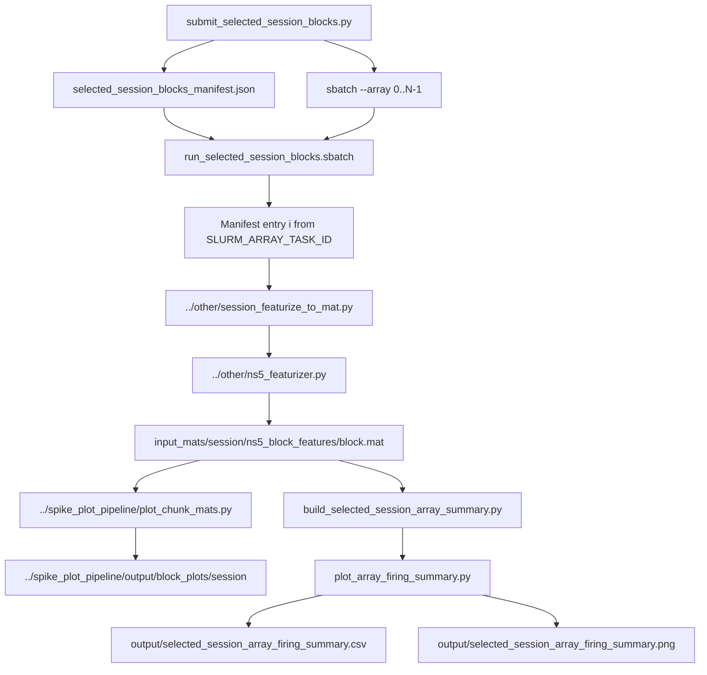

# Selected-Session Spiking Electrode Graph Pipeline

This README documents the small pipeline that turns a user-selected number of sessions into a graph of spiking-electrode counts versus session.

In this codebase, that workflow is built from these scripts:

- `submit_selected_session_blocks.py`
- `run_selected_session_blocks.sbatch`
- `run_selected_session_array_summary_local.sh`
- `build_selected_session_array_summary.py`
- `plot_array_firing_summary.py`

Terminology used in this README:

- `multi-session chosen-block manifest`
  - typical file: `selected_session_blocks_manifest.json`
  - meaning: one manifest entry per session, with exactly one chosen block in
    each session
- `single-session selected-block manifest`
  - typical file: `spike_plot_pipeline/manifests/<session>_parallel_blocks_manifest.json`
  - meaning: one manifest for one session, listing the selected blocks from that
    session

This cleaned repository snapshot does not include generated manifests,
`input_mats/`, plots, or summary outputs. The paths below describe the runtime
locations used when you run the workflow locally.

## What The Pipeline Does

The workflow is:

1. choose `N` consecutive sessions starting from a requested session
2. choose one representative block per session
3. use the selected local `.mat` files under `input_mats/`
4. count how many electrodes are "firing" in each session
5. draw a summary graph across those sessions

The summary graph is per array, not pooled across all arrays. With the current defaults, a 128-channel recording produces two lines on the plot, one for each 64-electrode array.

## How "Spiking Electrode" Is Defined

`plot_array_firing_summary.py` uses the threshold-crossing matrix `tx_from_ns5_45` by default.

For each electrode, it:

1. computes mean firing rate inside 30-second windows
2. takes the median of those windowed rates
3. calls the electrode "firing" if that median rate is greater than `2.0 Hz`

Counts are then computed separately for each 64-electrode array.

## Required Inputs

The graph builder needs:

- a manifest JSON with one entry per selected session, each containing `session` and `chosen_block`
- one standalone block feature file per chosen block:
  - `input_mats/<session>/ns5_block_features/<block>.mat`

When generated locally, selected `.mat` files are typically stored under:

- `spiking_electrode_graph_pipeline/input_mats/`

The graph pipeline reads those local copies by default and writes its own graph outputs under:

- `spiking_electrode_graph_pipeline/output/`

Block diagnostic plots are written separately under:

- `spike_plot_pipeline/output/block_plots/<session>/`

The default multi-session chosen-block manifest path in this workflow is:

- `selected_session_blocks_manifest.json`

The default local `.mat` root used by the summary scripts is:

- `spiking_electrode_graph_pipeline/input_mats/`

## Main Scripts

## Which Featurizer File Is Used

Both files are used, but at different levels:

- `../other/session_featurize_to_mat.py`
  - this is the pipeline/orchestration script
  - it selects the block, downloads NS5 files, loops over hubs, aligns outputs, and writes the final standalone `.mat`
- `../other/ns5_featurizer.py`
  - this is the low-level numerical feature extractor
  - it reads NS5 voltage and computes spike-band power, threshold crossings, LFP features, and related arrays

In the actual call chain:

- `run_selected_session_blocks.sbatch` runs `../other/session_featurize_to_mat.py`
- `../other/session_featurize_to_mat.py` imports and uses `../other/ns5_featurizer.py`

So the user-facing pipeline entry point is `session_featurize_to_mat.py`, and that script internally uses `ns5_featurizer.py`.

### `submit_selected_session_blocks.py`

This is the multi-session chosen-block manifest builder and optional SLURM
submitter.

It:

- lists sessions from GCS
- picks `--n-sessions` consecutive sessions starting at `--start-session`
- chooses one block per session
- writes the multi-session chosen-block manifest:
  `selected_session_blocks_manifest.json`
- optionally submits `run_selected_session_blocks.sbatch`

If `--submit` is used, it creates one SLURM array task per manifest entry.
That means:

- one multi-session chosen-block manifest entry = one selected `(session, block)`
- one SLURM array task = one selected `(session, block)`
- the full array job = all selected sessions processed in parallel, one block per task

Use this only when you want to regenerate the selected `.mat` files into `input_mats/`.

The block-selection rule is:

- choose the shortest block longer than `--min-duration-s`
- if none are longer than that threshold, choose the longest block

### `run_selected_session_blocks.sbatch`

This runs one multi-session chosen-block manifest entry at a time.

It does not process all selected sessions inside one task.
Instead, each task uses `SLURM_ARRAY_TASK_ID` to choose exactly one manifest
entry.

For each selected `(session, block)` pair, it:

- runs `../other/session_featurize_to_mat.py` on that block
- writes the standalone block feature file under `input_mats/<session>/ns5_block_features/`
- runs `../spike_plot_pipeline/plot_chunk_mats.py` for block-level diagnostic plots
- writes those diagnostic plots under `../spike_plot_pipeline/output/block_plots/<session>/`

## Submit vs Run

These two files have different roles:

- `submit_selected_session_blocks.py`
  - chooses the sessions
  - chooses one block per session
  - writes `selected_session_blocks_manifest.json`
  - submits the SLURM array job when `--submit` is used
- `run_selected_session_blocks.sbatch`
  - is the script each SLURM array task runs
  - reads the multi-session chosen-block manifest
  - uses `SLURM_ARRAY_TASK_ID` to select exactly one manifest entry
  - featurizes exactly one chosen block and writes exactly one standalone `.mat`

Example:

- if you select 20 sessions, `submit_selected_session_blocks.py` writes 20 manifest entries
- then it submits `sbatch --array=0-19 ...`
- task `0` runs `run_selected_session_blocks.sbatch` for manifest entry `0`
- task `1` runs `run_selected_session_blocks.sbatch` for manifest entry `1`
- and so on

So the submit script sets up the batch, and the `.sbatch` script does one unit of work.

## Multi-Session Chosen-Block Manifest Lifecycle

The default multi-session chosen-block manifest path for this pipeline is:

- `selected_session_blocks_manifest.json`

That file is written only by:

- `submit_selected_session_blocks.py`

It is then consumed by:

- `run_selected_session_blocks.sbatch`
- `run_selected_session_array_summary_local.sh`
- `build_selected_session_array_summary.py`
- `../spike_plot_pipeline/run_selected_session_pipeline_and_plots_local.sh`

If you generate `selected_session_blocks_manifest.json`, it is a saved snapshot
of the chosen sessions and chosen blocks. It is not recreated every time you
run a summary or plotting command. It changes only if you explicitly rerun
`submit_selected_session_blocks.py` or another wrapper that calls it.

### `run_selected_session_array_summary_local.sh`

This is the easiest end-to-end runner for the selected-session graph.

It:

- reads the multi-session chosen-block manifest
- skips sessions whose chosen block `.mat` already exists
- runs missing manifest entries through `run_selected_session_blocks.sbatch`
- then calls `build_selected_session_array_summary.py`

By default it uses the local `.mat` copies under `input_mats/`.

This script is local orchestration. It is not itself a SLURM array job.
If any chosen-block `.mat` files are missing, it submits a sparse SLURM array
covering only those missing manifest indices, waits for that job to leave the
queue, verifies that the expected `.mat` files now exist, and then builds the
final multi-session summary graph.

### `build_selected_session_array_summary.py`

This reads the multi-session chosen-block manifest, resolves the chosen `.mat`
files, and calls `plot_array_firing_summary.py` with session numbers as x-axis
labels. The CSV still keeps the original session names in the `label` column.

By default it writes:

- `output/selected_session_array_firing_summary.csv`
- `output/selected_session_array_firing_summary.png`

## Execution Flow



In plain terms:

- `submit_selected_session_blocks.py` chooses the sessions and blocks
- the multi-session chosen-block manifest `selected_session_blocks_manifest.json`
  records those choices
- `run_selected_session_blocks.sbatch` handles one chosen block per array task
- `build_selected_session_array_summary.py` builds one final graph after the selected `.mat` files exist

## Typical Usage

### 1. Build the manifest and submit block processing

This step is only needed if you want to generate or regenerate local
`input_mats/` copies.

#### Full pipeline example

```bash
python3 submit_selected_session_blocks.py \
  --subject t12 \
  --start-session t12.2025.11.04 \
  --root-data /path/to/local_data \
  --root-derived /path/to/repo/spiking_electrode_graph_pipeline/input_mats \
  --repo-dir /path/to/repo/other \
  --script-path /path/to/repo/spiking_electrode_graph_pipeline/run_selected_session_blocks.sbatch \
  --submit
```

Parameter notes:
- `--subject t12`: required subject name. No default.
- `--start-session t12.2025.11.04`: required first session in the consecutive run. No default.
- `--root-data /path/to/local_data`: required local data root used by the worker featurizer. No default.
- `--root-derived /path/to/repo/spiking_electrode_graph_pipeline/input_mats`: where generated `.mat` files are written.
- `--repo-dir /path/to/repo/other`: points the worker at the standalone featurizer code.
- `--script-path`: points at the sbatch worker to run per selected session.
- `--submit`: actually submits the SLURM array after writing the manifest.

Important defaults used here:
- `--bucket` defaults to `exp_sessions_nearline`.
- `--n-sessions` defaults to `10`.
- `--gsutil` defaults to `~/google-cloud-sdk/bin/gsutil`.
- `--min-duration-s` defaults to `300`.
- SLURM defaults are `partition=normal`, `time=12:00:00`, `mem=32G`, `cpus=4`.

### 2. Run the full selected-session graph workflow locally

#### Full pipeline completion example

```bash
bash run_selected_session_array_summary_local.sh \
  /path/to/repo/spiking_electrode_graph_pipeline/selected_session_blocks_manifest.json
```

What this command does:
- reads the chosen-block manifest
- submits sparse worker jobs only for missing `.mat` files
- waits for those jobs to finish
- builds the final array firing summary from the completed feature files

Important defaults used here:
- if no manifest path is passed, it defaults to `selected_session_blocks_manifest.json` in this directory
- if no second positional argument is passed, `root-derived` defaults to `input_mats`
- summary building is enabled by default; use `--skip-summary` only if you want to stop after materializing missing `.mat` files

### 3. Rebuild only the summary graph from existing `.mat` outputs

#### Partial pipeline example

```bash
python3 build_selected_session_array_summary.py \
  /path/to/repo/spiking_electrode_graph_pipeline/selected_session_blocks_manifest.json \
  --root-derived /path/to/repo/spiking_electrode_graph_pipeline/input_mats
```

What this command does:
- assumes the chosen-block `.mat` files already exist
- skips session selection and block featurization
- rebuilds only the CSV and plot summarizing firing electrodes per array

Parameters set explicitly:
- positional manifest path: required JSON file listing `(session, chosen_block)` entries.
- `--root-derived`: directory containing `<session>/ns5_block_features/<block>.mat`.

Important defaults used by this command:
- `--tx-key` defaults to `tx_from_ns5_45`.
- `--window-sec` defaults to `30.0`.
- `--firing-threshold-hz` defaults to `2.0`.
- `--array-size` defaults to `64`.
- `--x-label` defaults to `Session index`.
- `--out-prefix` defaults to `output/selected_session_array_firing_summary`.

## Outputs

The summary stage writes:

- `output/selected_session_array_firing_summary.csv`
- `output/selected_session_array_firing_summary.png`

Block-level diagnostic plots created during manifest runs are written under:

- `../spike_plot_pipeline/output/block_plots/<session>/`

The CSV has one row per `(session, array)` pair with these columns:

- `label`
- `input_file`
- `array_index`
- `array_name`
- `firing_electrodes`

The PNG is the session-by-session graph. The x-axis uses 1-based session
indices, and the y-axis is `Number of electrodes firing`.

In this cleaned repository snapshot, those output files are not checked in and
are ignored by git when generated locally.

## Notes

- This workflow assumes one representative block per session, not all blocks.
- The summary graph depends on the chosen threshold-crossing key; default is `tx_from_ns5_45`.
- The default firing definition uses median 30-second mean rate greater than `2 Hz`.
- The current plot shows counts per array. It does not sum all arrays into one single trace.
